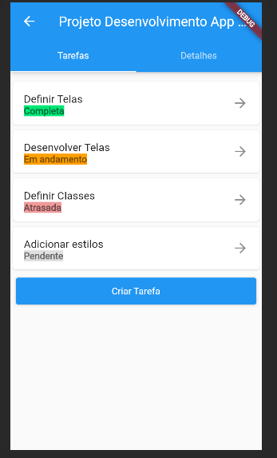
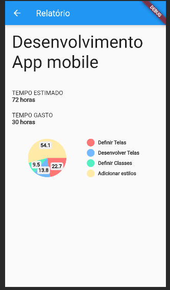
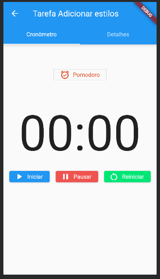
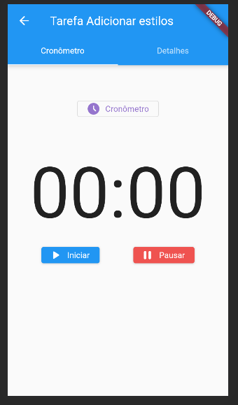

# Time Tracker

Uma aplicação mobile que facilita a gerencia de projetos e controle do tempo investido em tarefas dos projetos. 

Permite visualizar detalhes do projeto, prazos e informações de tarefas, gerar relatórios de projetos e contabilizar o tempo gasto em tarefas por meio de um conômetro comum e um conômetro no modelo de Pomodoro.
 
## Telas

  <figure style="margin: 0 10px;">
    
    <figcaption style="text-align: center;">Tarefas do Projeto</figcaption>
  </figure>
  <figure style="margin: 0 10px;">
    
    <figcaption style="text-align: center;">Relatório do Projeto</figcaption>
  </figure>

  <figure style="margin: 0 10px;">
    
    <figcaption style="text-align: center;">Cronômetro</figcaption>
  </figure>
  <figure style="margin: 0 10px;">
    
    <figcaption style="text-align: center;">Cronômetro Pomodoro</figcaption>
  </figure>

## User Stories

**US01 - Como usuário quero criar um projeto para gerenciar meu tempo gasto.** ✅

Descrição: Na página inicial, o usuário pode criar diferentes projetos nos quais ele quer controlar o tempo gasto trabalhado em cada um.

Critérios de Aceitação:

- Deve existir um botão de criação de projetos na tela inicial do aplicativo
- As informações de um projeto consistem em: nome, tempo estimado, data de início, data de entrega, valor cobrado (total ou por hora), tempo total.

**US02 - Como usuário quero verificar a viabilidade do projeto para decidir sobre seu seguimento.** ✅

Descrição: A funcionalidade deve permitir que o usuário visualize informações para decidir sobre a continuidade do projeto.

Critérios de Aceitação:

- Se o valor do projeto foi cobrado por horas, deve-se exibir o valor por hora já trabalhado
- Se por valor fixo, deve-se exibir quanto tempo resta para a conclusão do projeto e o valor do projeto

**US03 - Como usuário quero criar atividades em um projeto para particionar o desenvolvimento do projeto.** ✅

Descrição: O usuário pode criar atividades relacionadas a um projeto, podendo gerenciar o tempo de uma atividade em específico.

Critérios de Aceitação:

- Uma atividade só pode ser criada dentro de um projeto
- As informações de uma atividade são: descrição, estimativa de tempo, data de entrega, e tempo gasto (que é composto pelo tempo contado no aplicativo)
- O tempo gasto de uma atividade deve ser contabilizado no tempo total do projeto

**US04 - Como usuário quero criar relatórios sobre um projeto para analisar meu desempenho.** ✅

Descrição: A funcionalidade consiste em exibir um relatório contendo o tempo estimado, tempo total do projeto assim como as suas atividades e como elas compõem no tempo total do projeto.

Critérios de Aceitação:

- O relatório deve ser de um projeto apenas.
- Deve ser mostrado um relatório comparando o tempo estimado e o tempo total do projeto
- Deve ser mostrada todas as tarefas de um projeto

**US05 - Como usuário quero aplicar técnicas de controle de tempo para utilizar meu tempo de trabalho de forma eficaz.** ✅

Descrição: Ao selecionar para iniciar uma atividade, o usuário pode escolher entre usar um cronômetro normal, que irá contar o tempo de forma contínua até o usuário parar a contagem, ou utilizar a técnica de pomodoro, que irá realizar uma contagem de 25 minutos, e em seguida outra contagem como pausa de 5 minutos.

Critérios de Aceitação:

- Opções de contagem de tempo: cronômetro ou pomodoro
- Na opção de cronômetro, deve existir a opção de pausar o relógio e retomar a contagem.
- Na opção pomodoro, alertar o usuário nos momentos de início e fim do tempo de descanso (5 minutos)
- Ao encerrar a contagem, deve mostrar o tempo total e adicionar ao tempo da atividade/projeto.

**US06 - Como usuário quero criar uma conta para salvar meus projetos e atividades de forma remota.** ⭕

Descrição: Na tela inicial, mostrar um botão para criar uma conta, que precisaria dos campos de e-mail e senha.

Critérios de Aceitação:

- Os cadastros de e-mail devem ser únicos no sistema
- Ao criar uma conta, os projetos e atividades já cadastradas devem ser salvas após o primeiro acesso
